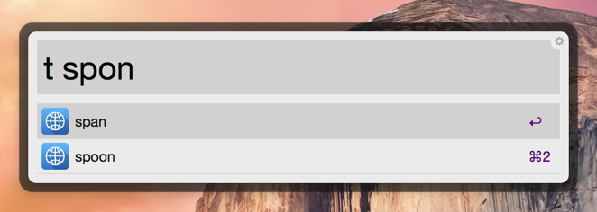

#RU-EN EN-RU Translating Alfred Workflow

[Скачать](https://github.com/podgorniy/alfred-translate/raw/master/Translate.alfredworkflow)

Удобный перевод текстов в en-ru ru-en направлениях. Не нужно указывать направление перевода, работает как с вводимым текстом, так и с выделенным, показывает несколько вариантов перевода для одного слова, автозаполнение для слов с ошибками (**NEW**), результат перевода копируется в буфер обмена. Для работы необходимо интернет соединение.

Перевод слова, запуск из строки Альфреда по ключевому слову `t`:

Перевод выделенного предложения по хоткею. Для себя настроил сочетание `ctrl+shift+t`.

Варианты автодополнения при ошибке в написании слова.

За иконку спасибо [Artem Beztsinnyi](http://bezart.ru).

Альтернативные workflow для перевода:

- [AlfredGoogleTranslateWorkflow](https://github.com/thomashempel/AlfredGoogleTranslateWorkflow)