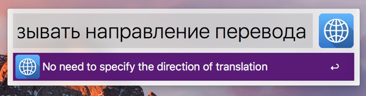

# RU-EN EN-RU Translating Alfred Workflow

[Скачать](https://github.com/podgorniy/alfred-translate/raw/master/Translate.alfredworkflow)
> Работает с версией macOs 12.4 и выше
> Работа на более поздних версиях подразумевает использования python3 

Удобный перевод текстов в en-ru ru-en направлениях.

- Переводит русский текст на английский. Английский текс в русский. Не нужно указывать направление перевода.
- Работает как с вводимым текстом, так и с выделенным.
- Показывает варианты перевода для одного слова.
- Показывает транскрипцию при переводе с английского.
- Исправляет ошибки в словах.
- Переводит как слова так и предложения.
- Копирует результат перевода в буфер обмена.
- Не работает без интернет соединения.

Перевод слова, запуск из строки Альфреда по ключевому слову `t` или `e`:

Перевод выделенного предложения по хоткею. Для себя настроил сочетание `ctrl+shift+t`.

Варианты автодополнения при ошибке в написании слова.

За иконку спасибо [Artem Beztsinnyi](http://bezart.ru).

Альтернативные workflow для перевода:

- [AlfredGoogleTranslateWorkflow](https://github.com/thomashempel/AlfredGoogleTranslateWorkflow)

## Changelog

**2020.10.06

- [denisborovikov](https://github.com/denisborovikov) убрал запрос к неработающему API yandex, и плагин снова работает.

**2020.06.13**

- Исправлена [экранизация пробелов](https://github.com/podgorniy/alfred-translate/issues/10).

**2019.06.27**

- Подхватываются настройки прокси из `.bashrc`

**2018.08.21**

- Добавлен перевод по русской букве `е`.

**2017.04.02**

- Улучшена производительность.
- Добавлена подсказка ошибок вместе с вариантами перевода.

2015.10.05
- Добавлено экранирование кавычек `'`.
